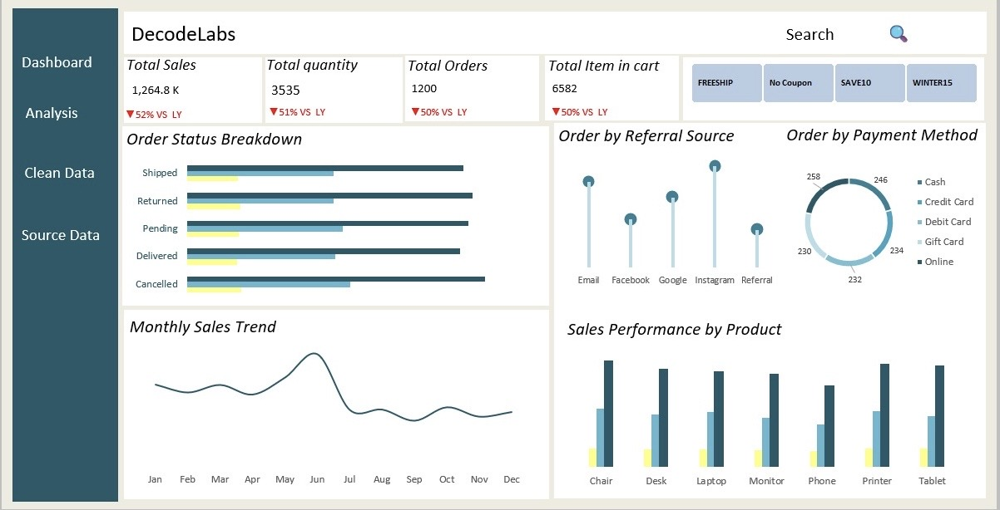

## Decodelabs Internship Project 

## Table of Content 
 - [Projects Overview](#project-overview)
 - [Project Objective](#project-objective)
 - [Tools](#tools) 
 - [Data Workflow](#data-workflow) 
 - [Key Metrics](#key-metrics)
 - [Data Cleaning and Transformation](#data-cleaning-and-transformation)
 - [Exploratory Data Analysis](#eploratory-data-analysis)
 - [Key Insights and Visuals](#key-insights-and-visuals)
 - [Recommendations](#recommendation)
 - [Assumptions](#assumptions)
 - [Limitations](#limitations)
 - [Author](#author)

### Project Overview 
 
 - This project resonant into three years of e-commerce data from 2023 to 2025 to figure out what is driving our sales and where we are losing money. I started by cleaning up the raw records in Excel and building pivot tables to track the core numbers and KPIs. From there, I moved everything into PostgreSQL to run deeper SQL queries and really understand our customer habits, top performing channels, and the underlying issues causing order cancellations.

### Project Objectives 

 - Measure total sales standing and overall order volume.
 - Identify top products driving revenue, volume, and customer demand.
 - Track order statuses, including delivered, shipped, pending, cancelled, and returned items.
 - Review customer payment choices and their impact on revenue.
 - Identify primary referral sources driving traffic and sales.
 - Evaluate how coupon usage affects overall sales and cancellations.
 - Spot higher cancellation rates across specific referral channels and coupon codes.
 - Track yearly and monthly sales patterns to spot seasonal growth.
 - Calculate key business metrics, including total sales, order count, units sold, average order value, and growth rates.

### Key Metrics

 - 2023 — Base Year
      - In 2023, total sales were 5,552, with 1,552 units sold across 510 orders. The total number of items in cart was 2,861. These figures serve as the base-year values for comparing performance in 2024 and 2025.

 - 2024 — Previous Year
      - In 2024, sales were 480.2K, while quantity sold decreased to 1,351 units. The number of orders also fell to 159, and items in cart decreased to 2,482. Compared with 2023, this shows a decline across most of the key metrics.

 - 2025 — Current Year
      - In 2025, sales decreased further to 231.9K, representing a 52.52% decline from 2024 and a 28% decline from the base year. Quantity sold fell to 660 units, a 51% year-on-year decrease and a 57% decline compared with 2023. The number of orders was 231, while items in cart decreased to 1,233, representing a 50% year-on-year decline and a 57% decline from 2023.

 - Overall Performance

      - Overall, the key metrics show a decline in sales, quantity sold, and items in cart between 2023 and 2025. This suggests that the business experienced a reduction in both sales activity and order volume during the period.

      - Another important finding is the high number of orders recorded as pending across the three years. Since each order has only one fixed status, these pending orders have not been counted as delivered or completed orders. This raises a further question about why so many orders remain pending. Possible reasons could include payment issues, incomplete orders, address problems, fulfillment delays, stock shortages, or processing issues.

      - Understanding why orders remain pending could help the business identify opportunities to recover sales from existing orders rather than relying only on acquiring new customers.

### Exploratory Data Analysis 

 - Data structure review 
      - Reviewed the 15 columns in the dataset, including order ID, order date, customer ID, product, quantity, price, shipping address, payment method, order status, tracking number, items in cart, coupon code, referral source, and total price. This helped clarify what each column represented.

 - Data cleaning 
      - Checked the dataset for missing values, duplicate records, inconsistent entries, and incorrect data types before beginning the analysis.

 - Category breakdown 
      - Reviewed the different values within key fields, including order status (cancelled, delivered, pending, returned, and shipped), payment method (cash, credit card, debit card, gift card, and online), and referral source (Facebook, Google, and Instagram).

 - Initial summary analysis 
      - Used Excel PivotTables to calculate totals, counts, and sums for sales, quantity, and items in cart. This provided an initial view of how sales and order activity were distributed across the different categories.

 - Time based analysis 
      - Reviewed the order dates and years covered by the dataset (2023–2025) to understand the period being analyzed and check for any gaps or unusual changes over time.

 - Outlier and anomaly check 
      - Reviewed price, quantity, and items in cart for unusually high or low values that could indicate data entry errors or unusual orders.

 - Order status integrity check 
      - Checked whether the same order ID appeared with more than one status, such as both “Returned” and “Delivered.” The check confirmed that each order ID had only one status. This means the status represents the recorded outcome for each order rather than a history of status changes, which was important when interpreting the returned, cancelled, pending, and delivered orders.

### Key Insights 

 - Sales by Coupon Code
      - Free Ship generated the highest sales value, followed by No Coupon, which represents records where the coupon code was blank and was relabeled as “No Coupon” during cleaning.

 - Cancelled Orders by Coupon Code
      - Free Ship and Winter15 had the highest number of cancelled orders, with 67 cancellations each.

 - Cancellation Rate by Coupon Code
      - Winter15 recorded the highest cancellation rate at 22.95%, followed by Free Ship at 21.41%.

 - Cancelled Orders by Referral Source
      - Email recorded the highest number of cancelled orders at 59, followed closely by Google with 58.

 - Cancellation Rate by Referral Source
      - Google had the highest cancellation rate at 24.07%, followed by Email at 23.60%.

 - Monthly Sales Trend
      - The number of cancelled orders varied between 4 and 14 across the months.

 - Overall KPIs
      - The dataset contains 1,200 orders, with total sales of 1,264,761.96, total quantity sold of 3,535, and 6,582 total items in cart.

 - Yearly Sales and Growth
      - Sales declined across all three years. Sales fell by 13.10% in 2024 compared with 2023, while 2025 recorded a further 51.71% year-on-year decline. Overall sales in 2025 were 58.74% lower than the 2023 base year.

 - Sales by Order Status
      - Cancelled orders recorded the highest sales value, followed by Pending orders.

 - Order Status by Year
      - In 2023, Pending orders were highest at 117, followed by Cancelled at 107 and Returned at 102. In 2024, Shipped orders were highest at 100, while Returned and Delivered orders tied at 97 each. In 2025, Cancelled orders were highest at 60, followed by Returned orders at 48.

 - Sales by Payment Method
      - Online had the highest number of orders at 258, followed by Credit Card with 234. However, Credit Card generated the highest sales value, followed by Online.

 - Sales by Product
      - Chair generated the highest sales value, closely followed by Printer.

 - Sales by Referral Source
      - Instagram generated the highest sales value, followed by Email.

 - Returned vs. Shipped Orders
      - No returned orders were also recorded as shipped, confirming that each order had a single final status.

